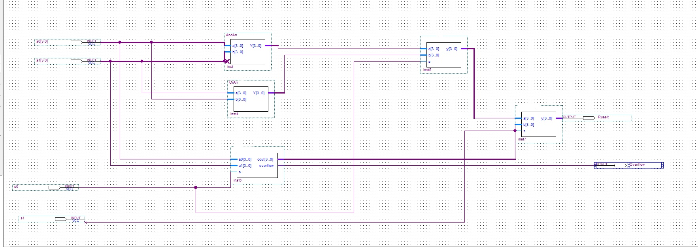

# Build Combinational Circuit

Using Verilog HDL on Quartus application i implement:

1. 1-bit adder and then use it to build 4-bit adder structurally

2. MUX2x1 and then use it to build the Quad MUX 2x1 structurally

3. 4-bit OR Array

4. 4-bit AND Array

